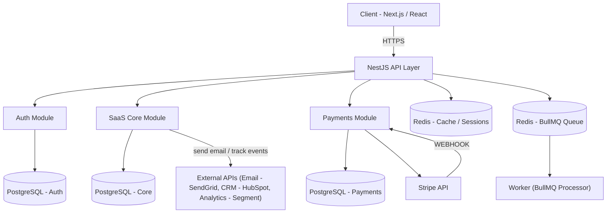
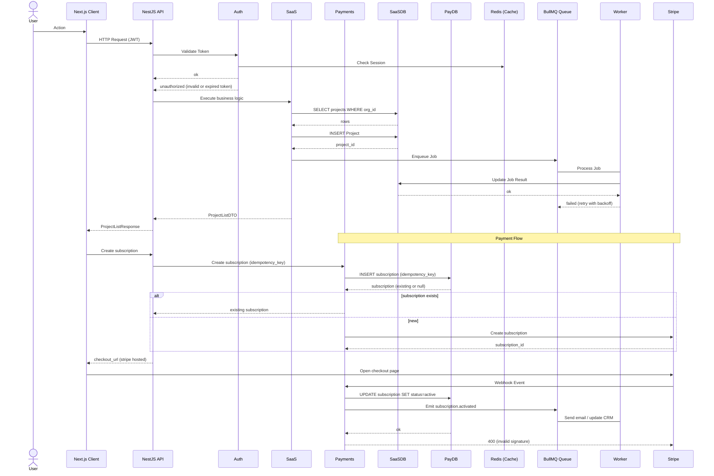

# SaaS Management Platform

SaaS Management Platform developed for managing organizations, users, and business operations in multi-tenant environments, providing access control, asynchronous processing, and integration with external services.

<br/>

> [!NOTE]
> MVP is currently under development.

<br/><br/>


---

## Overview

This Platform is a production-oriented full-stack application designed to demonstrate modern backend architecture, scalable application design, and enterprise development practices.

It allows organizations to manage isolated workspaces, users, projects, subscriptions, and business operations while integrating authentication, background processing, payment workflows, and external services into a unified architecture.

<br/><br/>


---

## Architecture

The application follows a modular architecture where each domain encapsulates its own business logic while sharing common infrastructure and application services.

<br/>

### System diagram:


---

### Request Flow diagram:


<br/><br/>


---

## Features

### Authentication:
- JWT authentication
- OAuth integration (Google and GitHub)
- Refresh tokens
- Session management

### Authorization:
- Role-Based Access Control (RBAC)
- Organization-level permissions
- Workspace isolation

### Business Logic:
- Multi-tenant architecture
- Subscription management
- Payment workflows
- External API integrations

### Performance:
- Cursor pagination
- Optimized database queries
- Redis caching
- Background job processing

### Infrastructure:
- Dockerized environment
- CI/CD pipelines
- Automated testing
- OpenAPI documentation

<br/><br/>


---

## Technology Stack

<div align="center">

| Category | Technologies |
|-----------|--------------|
| Frontend | React, Next.js |
| Backend | Node.js, NestJS |
| Database | PostgreSQL |
| ORM | Drizzle ORM |
| Cache | Redis |
| Queue | BullMQ |
| Authentication | JWT, OAuth |
| Payments | Stripe |
| Documentation | OpenAPI / Swagger |
| Testing | Jest, Playwright |
| Infrastructure | Docker, GitHub Actions |
| Deployment | Railway, Vercel |

</div>

<br/><br/>


---

## Getting Started

<br/>

> [!NOTE]
> Make sure to configure the `.env` file using the values provided in `.env.example`.

### Prerequisites:
- Node.js
- Docker
- PostgreSQL
- Redis

<br/><br/>


---

## Installation:
```bash
git clone https://github.com/DexxterGWM/saas-management-platform.git
cd saas-management-platform
npm install
```

<br/><br/>


---

## Repository
[saas-management-platform](https://github.com/DexxterGWM/saas-management-platform) - Made by: [@DexxterGWM](https://github.com/DexxterGWM)

<br/><br/>


---

## License

This project is intended for educational purposes and portfolio demonstration.

Built to explore production-ready software architecture, scalable backend development, and modern SaaS engineering practices.
